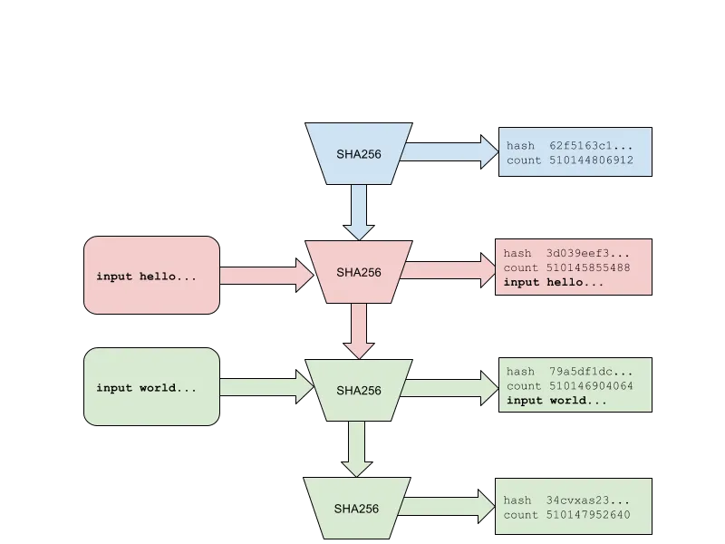

# Loom, Encoding Time as Data(将时间编码为数据)

> 区块链扩展的新方法

## 免责声明

本文中的所有声明和内容都是作者尽力而为的结果。读者有责任核实和验证其准确性和真实性。此外，本文中的任何内容都不构成对投资的邀请。

## Loom, Encoding Time as Data

扩展区块链是一个难题。不仅仅是扩展吞吐量困难，而且任何高性能的区块链都必须处理越来越多的数据。将比特币扩展到每秒仅25,000笔交易将每年产生1 PB的数据。

我们通过解决时间问题来解决这两个问题。Loom提出的关键创新是历史证明——将时间的流逝编码为账本中的数据。Loom利用时间的强假设构建更简单、更高效的共识和存储协议。

比特币和工作量证明账本是一种需要大量电力才能复制的数据结构。你可以查看数据并知道用了多少兆瓦特的电来创建它。当你查看一个历史证明账本时，你就知道花了多少时间来产生它。

比特币也是一种历史记录，人们在其之上建立了公证服务。你可以将一个文件进行哈希处理，然后将其插入比特币区块链中的一个区块，要想撤销该区块，就需要对整个比特币网络进行攻击。由于每个比特币区块每10分钟产生一次，你将始终拥有你的文件发布的“证据”。

历史账本的证明是一份可以记录每一微秒事件的历史记录。这个记录不需要信任，并且可以被全世界的每个人廉价快速地验证。

历史证明通过将一个像sha256这样的密码哈希函数循环运行在自身上，将其输出作为下一个输入。该过程生成了当前输出的样本以及循环次数。

这些哈希样本是Proof of History账本中的时间“刻度”。只有一个计算机核心可以生成这些数据，但可以使用多个核心并行验证。因此，一个包含1秒刻度的账本可以在0.25毫秒内由现代GPU进行验证。通过将数据附加到状态并记录到账本中，我们可以确保这些数据是在下一个刻度生成之前创建的。

对于整个网络和整个世界，我们只需要一个单一的计算机核心来生成历史证明。

Loom在1千兆比特网络上的理论最大交易量为710,000笔每秒，无需数据分区、侧链、多链、分片等。
