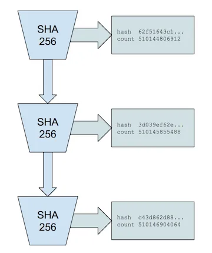

# 历史的证明：区块链的时钟

> Solana核心创新的高层解释

Solana是世界上性能最高的无许可区块链。在当前的Solana测试网络迭代中，由200个物理上不同的节点组成的网络，在使用GPU时，可以持续支持每秒超过50,000笔交易的吞吐量。要实现这样的性能，需要实施多项优化和新技术，其结果是网络容量的突破，标志着区块链发展的新阶段。

有8个关键创新使得Solana网络成为可能：

- 历史证明（POH）——共识之前的时钟；
- Tower BFT — 一种经过PoH优化的PBFT版本；
- 海湾流—无内存池交易转发协议；
- 海平面 — 并行智能合约运行时；
- 流水线——用于验证优化的事务处理单元
- Cloudbreak - 横向扩展的账户数据库；以及
- 复制器——分布式账本存储

分布式系统中最困难的问题之一是时间的一致性。事实上，有人[认为](https://grisha.org/blog/2018/01/23/explaining-proof-of-work/)比特币的工作证明算法最重要的特性就是作为系统的分散时钟。在[Solana](https://solana.com/zh)，我们相信历史证明提供了这个解决方案，并且我们已经基于此构建了一个区块链。

分散式网络通过可信的、集中式的时间解决方案解决了这个问题。例如，[谷歌的Spanner](https://static.googleusercontent.com/media/research.google.com/en//archive/spanner-osdi2012.pdf)使用其数据中心之间同步的原子钟。谷歌的工程师将这些时钟同步到非常高的精度，并不断维护它们。

在像区块链这样的对抗性系统中，这个问题变得更加困难。网络中的节点无法信任外部的时间来源或者出现在消息中的任何时间戳。

例如，[Hashgraph](https://www.hederahashgraph.com/)通过使用“中位数”时间戳来解决这个问题。网络中的每条消息都由网络的超过半数节点进行签名和时间戳。消息的中位数时间戳被Hashgraph称为“公平”排序。每条消息必须传递到系统中超过半数的节点，然后在消息收集足够的签名后，整个集合需要传播到整个网络。正如你可以想象的那样，这确实是一个复杂的过程。

如果您可以简单地相信编码到消息中的时间戳，那么您将拥有大量分布式系统优化的财富。例如，

> 同步时钟很有趣，因为它们可以用来提高分布式算法的性能。它们使得可以用本地计算来替代通信。
> - Liskov, B. 分布式系统中同步时钟的实际应用

在我们的情况下，这意味着一个高吞吐量、高性能的区块链

## 历史的证明

如果你可以证明消息发生在某个事件之前或之后，而不是仅仅依靠时间戳，会怎样呢？当你在《纽约时报》的封面上拍照时，你就创造了一个证明，证明你的照片是在该报纸发行之后拍摄的，或者你有某种方式可以影响《纽约时报》的出版内容。通过历史证明，你可以创建一个历史记录，证明某个事件发生在特定的时间点。

历史的证明是一种高频[可验证延迟函数](https://www.youtube.com/watch?v=qUoagL7OZ1k)。可验证延迟函数需要特定数量的连续步骤来评估，但产生的唯一输出可以高效地公开验证。

我们具体的实现使用了一个连续运行在自身上的顺序预映像抗碰撞哈希函数，前一个输出作为下一个输入。定期记录计数和当前输出。

对于SHA256哈希函数来说，除非使用2¹²⁸个核心进行暴力破解攻击，否则无法并行化该过程。
