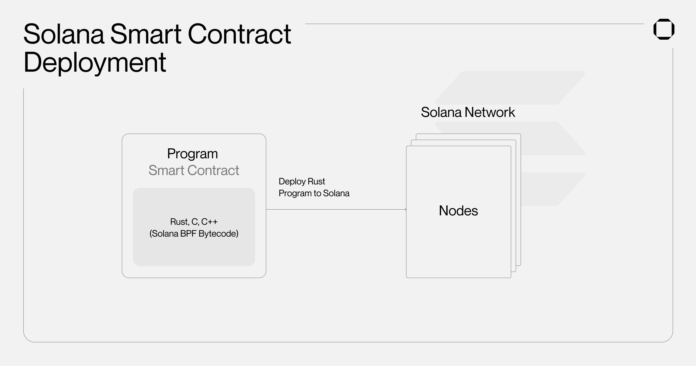
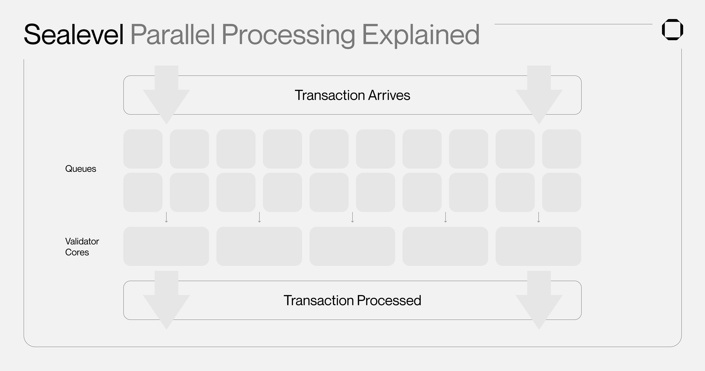
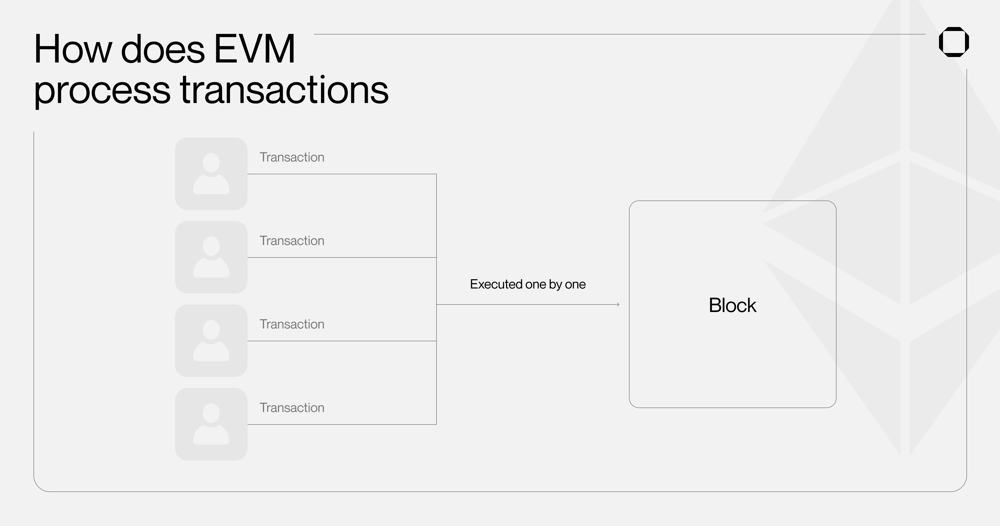
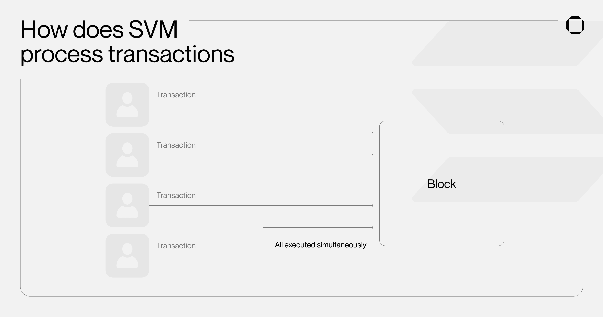
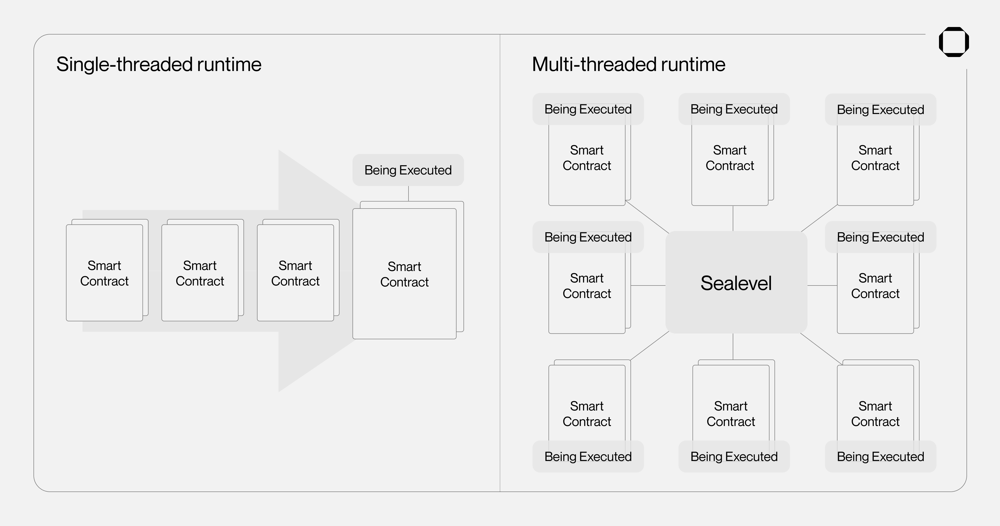
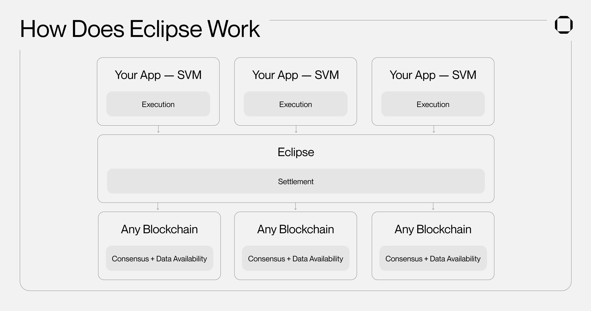

# 什么是SVM - Solana虚拟机

Solana因其卓越的性能能力而备受关注，被视为下一代高度可扩展的区块链。它能够处理数千笔每秒的交易，并且几乎没有任何费用。Solana先进技术的关键要素之一是其执行环境SVM，其中包括Sealevel并行化引擎。

本文介绍了Solana虚拟机（SVM）以及这一创新基础设施如何使Solana区块链在性能上超越传统的以太坊（Ethereum）等EVM区块链。虽然EVM长期以来一直是加密领域中主导的虚拟机标准，但我们还将探讨SVM如何通过Nitro和Eclipse等Rollup解决方案逐渐扩展。

## Solana虚拟机（SVM）和Sealevel Explained

Solana虚拟机（简称SVM）是在Solana网络上处理交易和智能合约/程序的执行环境。为了更好地理解SVM，我们首先需要了解加密网络中虚拟机的工作原理。

在区块链的背景下，虚拟机（VM）是一种运行程序的软件，更常被称为运行环境，用于执行加密网络中的智能合约。当提交一笔交易时，网络的虚拟机负责处理它并管理由该交易执行所影响的区块链的状态（整个网络的当前状态）。改变网络状态的具体规则由虚拟机定义。

在处理交易时，虚拟机将智能合约代码转换为可以由验证者硬件执行的格式。在Solana上，编写智能合约的主要语言是Rust、C和C++，它们通过Solana虚拟机（SVM）编译为**BPF字节码**，使得交易可以高效地由网络节点（验证者）执行。

Solana网络的节点被称为验证者，每个验证者都运行着自己独立的Solana虚拟机（SVM）环境，以维持区块链的共识。当一个智能合约被部署（修改网络状态）时，它会将所需的状态变化传达给运行时。然后，Solana运行时将这些状态变化转发给每个验证者系统中运行的SVM实例，所有验证者节点都会收到一份副本并进行翻译，从而更新区块链。这种将SVM实例分布在验证者之间的方式使得网络去中心化，降低了遭受DDoS攻击或关闭的风险。此外，这种隔离确保了智能合约中的潜在错误或漏洞不会危及整个Solana网络的安全性或稳定性。

总之，这些SVM实例可以被视为“迷你计算机”，根据交易提供的指令执行必要的操作来更新Solana网络的状态。虽然如今许多区块链依赖以太坊虚拟机（EVM），但Solana已经开发了自己的虚拟机，具备独特的能力，提供更高的性能。

SVM的关键组件是[Sealevel](https://medium.com/solana-labs/sealevel-parallel-processing-thousands-of-smart-contracts-d814b378192)。该引擎在Solana执行环境中实现了“水平”扩展，允许多个智能合约同时运行而不影响彼此的性能，这就是并行处理的概念。这是因为Solana智能合约在运行时描述了将要读取或写入的数据（状态）。这使得没有冲突的交易可以同时运行，以及那些只是读取相同信息的交易。因此，Sealevel使得SVM能够同时处理数万个交易，而不像以太坊虚拟机（EVM）一样逐个处理。

## SVM与EVM（以太坊虚拟机）

虽然EVM和SVM执行类似的功能，但Solana VM更高效且更快。在EVM上，当智能合约从用户余额中转移一美元时，该交易将存储在特定合约的存储中。这种设计可能会导致以太坊虚拟机在尝试并行处理多个交易时出现问题。例如，两个不同的智能合约可能同时尝试使用用户余额，或者另一个合约可能在更新过程中读取同一用户的余额，从而导致不一致和冲突。

相比之下，Solana的账户模型将数据（例如用户的余额）分离，以便更好地组织和提高效率。在Solana上，交易在SVM执行之前需要明确指定它们将读取和修改的数据。正如前面所说，这使得不与相同数据进行交互的程序能够并发运行，从而有助于缓解拥堵和降低高额费用。例如，Solana虚拟机可以同时处理Toly向Raj发送一美元和Armani向Chase发送三美元的交易。

EVM在同时处理多个交易时遇到困难的原因部分是因为它是一个"单线程"的运行环境，只能一次处理一个合约。由于这个原因，EVM设计没有利用多核硬件的优势，这意味着验证者硬件的只有一个核心在主动处理交易，而其他核心则未被充分利用。这经常导致网络拥堵和更高的交易费用。然而，需要注意的是，除了多线程运行时之外，其他因素也会对EVM的限制产生影响，比如希望保持运行节点的低硬件要求。

另一方面，Sealevel通过有效利用可用的硬件资源来优化Solana运行时的性能。SVM是一个多线程运行环境，旨在通过利用验证器机器上所有可用的核心并行处理多个交易。随着验证器硬件的不断改进，这使得Solana能够更有效地扩展。Solana虚拟机还可以通过其架构更好地管理交易费用。这导致了[本地化费用市场](https://twitter.com/7LayerMagik/status/1615569374647287808?s=20)的发展，使得可以为每个智能合约分配费用。相比之下，EVM链依赖于全局费用市场，这意味着NFT铸造可能会影响到与之无关的交换或DeFi交易。

由于这些原因，SVM的并行处理能力使得Solana能够实现显著更高的TPS，从而实现更快的交易速度，并且与EVM架构相比，几乎没有可见的费用。这使得SVM成为下一代区块链环境，更加高效和高性能。随着越来越多的开发者认识到这一点，我们开始看到SVM作为智能合约执行环境的采用率增加，同时也出现了一个新兴的SVM Rollup生态系统。

## SVM Rollups的新兴生态系统

Rollup是一种区块链扩容解决方案，它在Layer 1区块链（例如Solana）之外处理交易，并随后将数据追溯性地发布到Layer 1。Rollup旨在通过将多个交易捆绑成一个单一的“证明”，从而减少网络拥堵和交易费用，并将其提交到主链。构建Rollup的最大优势在于能够完全定制链。这种定制化允许实现各种用例，例如定制的订单簿、用于最小化MEV（矿工可提取价值）的加密内存池，或者根据特定要求设计的权限应用程序。

虚拟机还可以用于简化使用相同虚拟机的其他链上开发者的部署过程。这种网络效应极大地惠及了以太坊及其虚拟机，因为它是加密智能合约的首个运行环境。因此，EVM一直是构建Rollup区块链所使用的主要执行环境。在两种Rollup类型中，乐观Rollup和零知识Rollup，像Arbitrum这样的[乐观Rollup](https://www.eclipse.builders/blog/eclipse-glossary#optimistic-rollup)是最为广泛采用的。最近，SVM在将Rollup技术引入Solana开发者方面取得了许多进展。为Solana构建Rollup的主要项目有[Nitro](https://www.nitro.technology/)和[Eclipse](https://www.eclipse.builders/)。

Nitro是一种乐观的Rollup解决方案，类似于Arbitrum或Optimism，它利用Solana虚拟机（SVM）使Solana开发人员能够将他们的dApps移植到各种生态系统中。Nitro计划首先在Sei上推出，Sei是基于Cosmos构建的特定行业交易链，然后再扩展到其他链。它利用SVM进行并行执行交易，这意味着用户可以像在Solana上一样执行操作，而Nitro则使用Sei进行结算和共识。此外，由于Sei是Cosmos生态系统的一部分，Nitro的项目及其用户将能够从IBC互操作技术中受益，访问Cosmos的资产和流动性。

另一个正在开发中的SVM汇总解决方案是Eclipse，旨在促进可定制汇总的部署。Eclipse的乐观汇总使项目能够创建自己独特的应用链，同时从已建立的网络（例如Cosmos应用链、Polygon、以太坊）的安全性中受益，并利用Solana虚拟机（SVM）。SVM作为执行环境，Eclipse负责结算，开发者选择的Layer 1网络负责共识和数据可用性（DA）的管理。目前，Eclipse提供乐观汇总解决方案，但也正在努力推出zk-汇总。

Eclipse已经宣布了两个基于SVM的汇总解决方案：

- Polygon SVM：通过这个卷起功能，任何建立在Solana上的项目都可以轻松部署到Polygon网络上；
- Cascade：由Injective和Eclipse引入，Cascade是为IBC生态系统优化的SVM汇总。它将使Solana项目能够轻松部署到Cascade，并访问Cosmos应用链的资产和流动性。此外，Injective上的项目现在可以利用Cascade的并行化SVM。

所有这些解决方案都简化了Solana虚拟机的使用，并扩大了其影响力。来自其他链的用户也将能够“尝试”Solana的并行化体验，无需摩擦，这可能导致更多人认识到SVM的优越性，从而将他们的dApp迁移到Solana以从其架构中受益，并吸引更多用户。

## SVM是开发者的下一代区块链环境

尽管年仅三岁，Solana已经展现出令人印象深刻的表现，而像Nitro和Eclipse这样的扩展解决方案在其虚拟机上的开发突显了其创新执行架构的成功。Solana能够从比特币和以太坊等老网络面临的挑战中吸取教训。比特币并非为智能合约而设计，这导致了以太坊的出现。同样，以太坊并未准备好迎接大规模采用和高速交易，为Solana和并行处理铺平了道路。此外，开发者对SVM环境的访问变得更加容易，Neon Labs将Solidity与Solana运行时兼容，而即将推出的Runtime v2升级将使开发者能够使用多种编程语言（如Move）构建与SVM兼容的dApp。

显然，Solana虚拟机为构建下一代应用程序提供了更先进的环境。交易的并行处理能够实现更高的吞吐量，类似于传统金融中的可能性，使开发人员能够构建任何类型的产品，而不必担心速度限制或费用。在具有高达15的TPS的链上构建不会使加密货币得到大规模采用。多亏了SVM和Sealevel，Solana可以（已经）处理数千个交易，而不会拥堵或产生明显的燃气费用，使其成为构建这些新应用程序的理想环境。随着验证者硬件的改进，Solana的Sealevel运行时将能够并行处理更多的交易，扩大SVM和EVM之间的差距，同时吸引更多用户。

Squads将支持Solana虚拟机（SVM）的扩展，并为整个SVM生态系统引入多签名（multisig）功能，使任何人都能够使用最佳的区块链执行环境以及最佳的自托管体验来管理链上资产。
