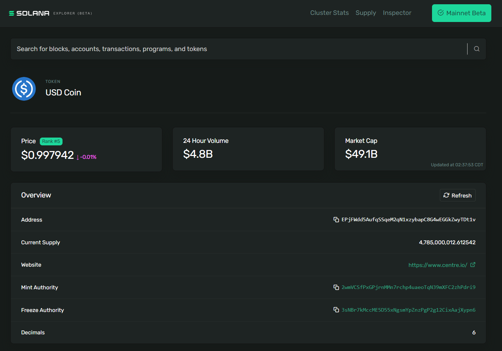

# 使用Token Program 创建Token

## TL;DR 长话短说

- `SPL` 代币代表 Solana 网络上的所有非本地代币。 Solana 上的同质代币和非同质代币 (NFT) 都是 `SPL` 代币
- Token Program 包含创建 SPL 令牌并与之交互的操作指南
- Token Mints 是持有特定代币数据但不持有代币的账户
- Token Accounts 用于持有特定Token Mint的代币
- 创建Token Mint和Token Accounts户需要在 SOL 中分配租金。 Token 账户的租金可以在账户关闭时退还，但是 Token Mints 目前无法关闭

## 概述

Token Program是 Solana 程序库 (SPL) 提供的众多程序之一。它包含创建 SPL 令牌并与之交互的操作指南。这些代币代表 Solana 网络上的所有非原生（即非 SOL）代币。

本课程将重点介绍使用令牌计划创建和管理新 SPL 令牌的基础知识：

1. 创建一个新的Token Mints
2. 创建Token Accounts
3. 铸币
4. 将代币从一个持有者转移到另一个持有者
5. 燃烧代币

我们将使用 `@solana/spl-token` Javascript 库从开发过程的客户端来解决这个问题。

## 代币铸造

要创建新的 SPL 代币，您首先必须创建Token Mints。Token Mints是保存特定代​​币数据的**账户**。

作为示例，我们来看看 [Solana Explorer 上的美元硬币 (USDC)](https://explorer.solana.com/address/EPjFWdd5AufqSSqeM2qN1xzybapC8G4wEGGkZwyTDt1v)。 USDC 的代币铸造地址为 `EPjFWdd5AufqSSqeM2qN1xzybapC8G4wEGGkZwyTDt1v`。通过浏览器，我们可以看到有关 USDC Token Mint 的具体详细信息，例如当前的代币供应量、铸币和冻结机构的地址以及代币的小数精度：



要创建新的代币铸币厂，您需要向代币计划发送正确的交易指令。为此，我们将使用 `@solana/spl-token` 中的 createMint 函数。

```ts
const tokenMint = await createMint(
    connection,
    payer,
    mintAuthority,
    freezeAuthority,
    decimal
);
```

createMint 函数返回新代币铸造的公钥。该函数需要以下参数：

1. 连接 - 与集群的 JSON-RPC 连接
2. payer - 交易付款人的公钥
3. mintAuthority - 被授权从代币铸币厂实际铸造代币的帐户。
4. freezeAuthority - 有权冻结令牌帐户中令牌的帐户。如果冻结不是所需的属性，则该参数可以设置为 null
5. 小数 - 指定令牌所需的小数精度

当从有权访问您的密钥的脚本创建新的薄荷时，您可以简单地使用 createMint 函数。但是，如果您要构建一个网站以允许用户创建新的代币铸币厂，则需要使用用户的密钥来执行此操作，而不会让他们将其暴露给浏览器。在这种情况下，您可能希望使用正确的指令构建并提交交易。

在底层，createMint 函数只是创建一个包含两条指令的交易：

1. 创建一个新账户
2. 初始化一个新的mint

这看起来如下：

```ts
import * as web3 from '@solana/web3'
import * as token from '@solana/spl-token'

async function buildCreateMintTransaction(
    connection: web3.Connection,
    payer: web3.PublicKey,
    decimals: number
): Promise<web3.Transaction> {
    const lamports = await token.getMinimumBalanceForRentExemptMint(connection);
    const accountKeypair = web3.Keypair.generate();
    const programId = token.TOKEN_PROGRAM_ID

    const transaction = new web3.Transaction().add(
        web3.SystemProgram.createAccount({
            fromPubkey: payer,
            newAccountPubkey: accountKeypair.publicKey,
            space: token.MINT_SIZE,
            lamports,
            programId,
        }),
        token.createInitializeMintInstruction(
            accountKeypair.publicKey,
            decimals,
            payer,
            payer,
            programId
        )
    );

    return transaction
}
```

当手动构建创建新代币铸币厂的指令时，请确保将创建帐户和初始化铸币厂的指令添加到同一交易中。如果您要在单独的交易中执行每个步骤，理论上其他人可能会使用您创建的帐户并将其初始化为他们自己的铸币厂。

## 租金和租金减免


请注意，前面代码片段的函数体中的第一行包含对 getMinimumBalanceForRentExemptMint 的调用，其结果被传递到 createAccount 函数中。这是帐户初始化的一部分，称为租金免除。

直到最近，Solana 上的所有账户都必须执行以下操作之一，以避免被取消分配：

1. 按特定时间间隔支付租金
2. 初始化时存入足够的 SOL 即可被视为免租

最近，第一个选项被取消，并要求在初始化新账户时存入足够的 SOL 以获得租金减免。

在本例中，我们正在为代币铸造创建一个新帐户，因此我们使用 @solana/spl-token 库中的 getMinimumBalanceForRentExemptMint。但是，此概念适用于所有帐户，您可以在 Connection 上使用更通用的 getMinimumBalanceForRentExemption 方法来创建您可能需要创建的其他帐户。

## 代币账户

在铸造代币（发行新供应）之前，您需要一个代币账户来持有新发行的代币。

代币账户持有特定“铸币厂”的代币，并拥有指定的账户“所有者”。只有所有者有权减少代币账户余额（转账、销毁等），而任何人都可以向代币账户发送代币以增加其余额。

您可以使用 spl-token 库的 createAccount 函数来创建新的令牌帐户：

```ts
const tokenAccount = await createAccount(
    connection,
    payer,
    mint,
    owner,
    keypair
);
```

createAccount 函数返回新令牌帐户的公钥。该函数需要以下参数：
- 连接 - 与集群的 JSON-RPC 连接
- payer - 交易付款人的账户
- mint - 新代币账户关联的代币铸币厂
- Owner - 新代币账户所有者的账户
- keypair - 这是一个可选参数，用于指定新的令牌帐户地址。如果未提供密钥对，则 createAccount 函数默认派生自关联的铸币厂和所有者帐户。

请注意，当我们深入了解 createMint 函数的内部结构时，此 createAccount 函数与上面显示的 createAccount 函数不同。之前我们使用SystemProgram上的createAccount函数返回创建所有帐户的指令。这里的 createAccount 函数是 spl-token 库中的一个辅助函数，它使用两条指令提交交易。第一个创建帐户，第二个将帐户初始化为令牌帐户。

与创建 Token Mint 一样，如果我们需要手动为 createAccount 构建交易，我们可以复制该函数在后台执行的操作：

1. 使用 getMint 检索与铸币厂关联的数据
2. 使用 getAccountLenForMint 计算代币账户所需的空间
3. 使用 getMinimumBalanceForRentExemption 计算租金豁免所需的 lamport
4. 使用 SystemProgram.createAccount 和 createInitializeAccountInstruction 创建新事务。请注意，此 createAccount 来自 @solana/web3.js，用于创建通用新帐户。 createInitializeAccountInstruction 使用此新帐户来初始化新令牌帐户

```ts
import * as web3 from '@solana/web3'
import * as token from '@solana/spl-token'

async function buildCreateTokenAccountTransaction(
    connection: web3.Connection,
    payer: web3.PublicKey,
    mint: web3.PublicKey
): Promise<web3.Transaction> {
    const mintState = await token.getMint(connection, mint)
    const accountKeypair = await web3.Keypair.generate()
    const space = token.getAccountLenForMint(mintState);
    const lamports = await connection.getMinimumBalanceForRentExemption(space);
    const programId = token.TOKEN_PROGRAM_ID

    const transaction = new web3.Transaction().add(
        web3.SystemProgram.createAccount({
            fromPubkey: payer,
            newAccountPubkey: accountKeypair.publicKey,
            space,
            lamports,
            programId,
        }),
        token.createInitializeAccountInstruction(
            accountKeypair.publicKey,
            mint,
            payer,
            programId
        )
    );

    return transaction
}
```

## 关联代币账户

关联令牌帐户是使用所有者的公钥和令牌铸币厂派生出令牌帐户地址的令牌帐户。关联的令牌帐户提供了一种确定性的方法来查找特定令牌铸币厂的特定公钥所拥有的令牌帐户。大多数时候，您创建令牌帐户时，您会希望它是关联令牌帐户。

与上面类似，您可以使用 spl-token 库的 createAssociatedTokenAccount 函数创建关联的令牌帐户。

```ts
const associatedTokenAccount = await createAssociatedTokenAccount(
    connection,
	payer,
	mint,
	owner,
);
```

此函数返回新关联令牌帐户的公钥，并需要以下参数：
- 连接 - 与集群的 JSON-RPC 连接
- payer - 交易付款人的账户
- mint - 新代币账户关联的代币铸币厂
- Owner - 新代币账户所有者的账户

您还可以使用 getOrCreateAssociatedTokenAccount 获取与给定地址关联的令牌帐户，如果不存在则创建它。例如，如果您正在编写代码向给定用户空投代币，您可能会使用此函数来确保创建与给定用户关联的代币帐户（如果该帐户尚不存在）。

在底层，createAssociatedTokenAccount 正在做两件事：

1. 使用 getAssociatedTokenAddress 从铸币厂和所有者处获取关联的代币账户地址
2. 使用 createAssociatedTokenAccountInstruction 中的指令构建交易

```ts
import * as web3 from '@solana/web3'
import * as token from '@solana/spl-token'

async function buildCreateAssociatedTokenAccountTransaction(
    payer: web3.PublicKey,
    mint: web3.PublicKey
): Promise<web3.Transaction> {
    const associatedTokenAddress = await token.getAssociatedTokenAddress(mint, payer, false);

    const transaction = new web3.Transaction().add(
        token.createAssociatedTokenAccountInstruction(
            payer,
            associatedTokenAddress,
            payer,
            mint
        )
    )

    return transaction
}
```
## 铸币代币

铸造代币是发行新代币进入流通的过程。当您铸造代币时，您可以增加代币铸造的供应并将新铸造的代币存入代币账户。只有代币铸造厂的铸造机构才被允许铸造新的代币。


要使用 spl-token 库铸造代币，您可以使用 mintTo 函数。

```ts
const transactionSignature = await mintTo(
    connection,
    payer,
    mint,
    destination,
    authority,
    amount
);
```

mintTo 函数返回一个可以在 Solana Explorer 上查看的 TransactionSignature。 mintTo 函数需要以下参数

- 连接 - 与集群的 JSON-RPC 连接
- payer - 交易付款人的账户
- mint - 新代币账户关联的代币铸币厂
- 目的地 - 将铸造代币的代币帐户
- Authority - 被授权铸造代币的账户
- amount - 在小数点之外铸造的代币原始数量，例如如果 Scrooge Coin 铸币厂的小数属性设置为 2，那么要获得 1 个完整的 Scrooge Coin，您需要将此属性设置为 100

在代币被铸造后，将代币铸造上的铸造权限更新为空的情况并不少见。这将设定最大供应量并确保将来不会铸造代币。相反，可以将铸造权授予程序，以便可以定期或根据可编程条件自动铸造代币。

在底层，mintTo 函数只是使用从 createMintToInstruction 函数获得的指令创建一个交易。

```ts
import * as web3 from '@solana/web3'
import * as token from '@solana/spl-token'

async function buildMintToTransaction(
    authority: web3.PublicKey,
    mint: web3.PublicKey,
    amount: number,
    destination: web3.PublicKey
): Promise<web3.Transaction> {
    const transaction = new web3.Transaction().add(
        token.createMintToInstruction(
            mint,
            destination,
            authority,
            amount
        )
    )

    return transaction
}
```

## 转移代币

SPL 代币转账要求发送者和接收者都拥有用于所转移代币铸造的代币账户。代币从发送者的代币账户转移到接收者的代币账户。

您可以在获取接收方关联的代币账户时使用 getOrCreateAssociatedTokenAccount 来确保其代币账户在转账前存在。请记住，如果帐户尚不存在，则此函数将创建该帐户，并且交易的付款人将被借记创建帐户所需的 lamports。

一旦您知道接收者的代币账户地址，您就可以使用 spl-token 库的转账功能来转账代币。


```ts
const transactionSignature = await transfer(
    connection,
    payer,
    source,
    destination,
    owner,
    amount
)
```
传输函数返回一个可以在 Solana Explorer 上查看的 TransactionSignature。传递函数需要以下参数：
- 将 JSON-RPC 连接连接到集群
- payer 交易付款人的账户
- 获取发送代币的代币账户
- 接收代币的代币账户的目的地
- 所有者 源代币帐户所有者的帐户
- amount 要转移的代币数量

在底层，传输函数只是使用从 createTransferInstruction 函数获得的指令创建一个交易：

```ts
import * as web3 from '@solana/web3'
import * as token from '@solana/spl-token'

async function buildTransferTransaction(
    source: web3.PublicKey,
    destination: web3.PublicKey,
    owner: web3.PublicKey,
    amount: number
): Promise<web3.Transaction> {
    const transaction = new web3.Transaction().add(
        token.createTransferInstruction(
            source,
            destination,
            owner,
            amount,
        )
    )

    return transaction
}
```

## 销毁代币

销毁代币是减少给定代币铸币厂代币供应的过程。销毁代币会将它们从给定的代币账户和更广泛的流通中删除。

要使用 spl-token 库刻录代币，请使用 burn 函数。

```ts
const transactionSignature = await burn(
    connection,
    payer,
    account,
    mint,
    owner,
    amount
)
```

刻录函数返回一个可以在 Solana Explorer 上查看的 TransactionSignature。 burn 函数需要以下参数：


- 将 JSON-RPC 连接连接到集群
- payer 交易付款人的账户
- account 要燃烧代币的代币账户
- 铸造 与代币账户关联的代币铸造
- 所有者 代币帐户所有者的帐户
- amount 要燃烧的代币数量

在幕后，burn 函数使用从 createBurnInstruction 函数获得的指令创建一个交易：

```ts
import * as web3 from '@solana/web3'
import * as token from '@solana/spl-token'

async function buildBurnTransaction(
    account: web3.PublicKey,
    mint: web3.PublicKey,
    owner: web3.PublicKey,
    amount: number
): Promise<web3.Transaction> {
    const transaction = new web3.Transaction().add(
        token.createBurnInstruction(
            account,
            mint,
            owner,
            amount
        )
    )

    return transaction
}
```


## 批准委托

批准委托是授权另一个帐户从代币帐户转移或销毁代币的过程。当使用委托时，代币账户的权限仍然属于原始所有者。受托人可以转让或销毁的最大代币数量是在代币账户所有者批准受托人时指定的。请注意，在任何给定时间只能有一个委托帐户与令牌帐户关联。

要使用 spl-token 库批准委托，您可以使用approve 函数。

```ts
const transactionSignature = await approve(
    connection,
    payer,
    account,
    delegate,
    owner,
    amount
  )
```


批准函数返回一个可以在 Solana Explorer 上查看的 TransactionSignature。批准函数需要以下参数：

- 将 JSON-RPC 连接连接到集群
- payer 交易付款人的账户
- account 从中委托代币的代币账户
- 委托所有者授权的账户转移或销毁代币
- 所有者 代币帐户所有者的帐户
- amount 代表可以转让或销毁的最大代币数量

在幕后，approve 函数使用从 createApproveInstruction 函数获得的指令创建一个交易：

```ts
import * as web3 from '@solana/web3'
import * as token from '@solana/spl-token'

async function buildApproveTransaction(
    account: web3.PublicKey,
    delegate: web3.PublicKey,
    owner: web3.PublicKey,
    amount: number
): Promise<web3.Transaction> {
    const transaction = new web3.Transaction().add(
        token.createApproveInstruction(
            account,
            delegate,
            owner,
            amount
        )
    )

    return transaction
}
```

## 撤销委托

之前批准的代币账户委托可以稍后撤销。一旦委托被撤销，委托人就不能再从所有者的代币账户中转移代币。先前批准的金额中未转移的任何剩余金额不能再由受托人转移。

要使用 spl-token 库撤销委托，您可以使用 revoke 函数。

```ts
const transactionSignature = await revoke(
    connection,
    payer,
    account,
    owner,
  )
```

撤销函数返回一个可以在 Solana Explorer 上查看的 TransactionSignature。撤销函数需要以下参数：

- 将 JSON-RPC 连接连接到集群
- payer 交易付款人的账户
- account 撤销委托的token账户
- 所有者 代币帐户所有者的帐户
- 在幕后，撤销函数使用从 createRevokeInstruction 函数获得的指令创建一个交易：

```ts
import * as web3 from '@solana/web3'
import * as token from '@solana/spl-token'

async function buildRevokeTransaction(
    account: web3.PublicKey,
    owner: web3.PublicKey,
): Promise<web3.Transaction> {
    const transaction = new web3.Transaction().add(
        token.createRevokeInstruction(
            account,
            owner,
        )
    )

    return transaction
}
```
