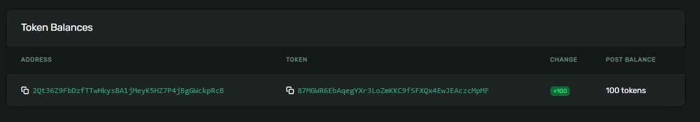
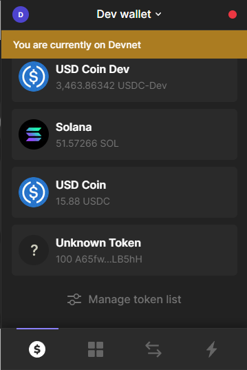

# 2. 🏧 在 Solana 上铸造Token

说得够多了，让我们来赚点神奇的互联网钱吧。在我们的最终项目中，我们将创建一个Token，随着时间的推移，当您质押社区 NFT 时，您将获得该Token。在我们到达那里之前，让我们尝试一下实际构建这个铸币过程的过程。这是发挥你的想象力并从中获得乐趣的好时机。也许您一直想创建自己的模因币——现在就是您的机会🚀

我们将从新的 Solana 客户端开始，前往您的 Solana 工作区并运行以下命令：

```bash
npx create-solana-client [you-token-name] --initialize-keypair
cd [you-token-name]
npm i
```

以您的Token命名您的客户端。我要制作pizzecoin，因为我昨天吃了一些非常好的披萨。这是你发挥创造力的时间。也许你想标记时间本身？你可以制作HokageCoin，甚至 `TwitterThreadCoin`。无限可能！

`--initialize-keypair` 标志具有我们上次使用 `initalizeKeypair` 所做的所有魔力。运行 `npm run start` ，您将获得一个新的密钥对，其中包含一些空投的 SOL。让我们打开印钞机，让它运转起来吧。


图为：美国联邦储备银行行长杰罗姆·鲍威尔正在让打印机运转起来。

## 🎁 构建一个Token铸造者


记住步骤：
1. 创建一个Token Mint账户
2. 为特定钱包创建关联的Token账户
3. 将Token铸造到该钱包


这是 `src/index.ts` 中的步骤 1，将其放在导入之后和 main() 之上：

```ts
// Add the spl-token import at the top
import * as token from "@solana/spl-token"

async function createNewMint(
    connection: web3.Connection,
    payer: web3.Keypair,
    mintAuthority: web3.PublicKey,
    freezeAuthority: web3.PublicKey,
    decimals: number
): Promise<web3.PublicKey> {

    const tokenMintAccount = await token.createMint(
        connection,
        payer,
        mintAuthority,
        freezeAuthority,
        decimals
    );

    console.log(`The token mint account address is ${tokenMintAccount}`)
    console.log(
        `Token Mint: https://explorer.solana.com/address/${tokenMintAccount}?cluster=devnet`
    );

    return tokenMint;
}
```

这看起来应该很熟悉。如果没有，请返回上一节并再次阅读😠

再次强调 - `@solana/spl-token` 程序使这一切变得简单。 `tokenMint` 是代币铸造账户的地址。


接下来，我们要创建关联的token帐户，将其放在 createNewMint 函数之后：

```ts
async function createTokenAccount(
    connection: web3.Connection,
    payer: web3.Keypair,
    mint: web3.PublicKey,
    owner: web3.PublicKey
) {
    const tokenAccount = await token.getOrCreateAssociatedTokenAccount(
        connection,
        payer,
        mint,
        owner
    )

    console.log(
        `Token Account: https://explorer.solana.com/address/${tokenAccount.address}?cluster=devnet`
    )

    return tokenAccount
}
```

这里没什么新鲜事。需要注意的一件事是 `payer` 和 `owner` 可以不同 - 您可以付费创建某人的帐户。这可能会变得昂贵，因为您将为他们的帐户支付“租金”，因此请确保在没有进行数学计算的情况下不要这样做。

最后是 mint 函数：


```ts
async function mintTokens(
  connection: web3.Connection,
  payer: web3.Keypair,
  mint: web3.PublicKey,
  destination: web3.PublicKey,
  authority: web3.Keypair,
  amount: number
) {
  const mintInfo = await token.getMint(connection, mint)

  const transactionSignature = await token.mintTo(
    connection,
    payer,
    mint,
    destination,
    authority,
    amount * 10 ** mintInfo.decimals
  )

  console.log(
    `Mint Token Transaction: https://explorer.solana.com/tx/${transactionSignature}?cluster=devnet`
  )
}

```

让我们在主函数中调用其中的每一个，这就是我所得到的：


```ts
async function main() {
  const connection = new web3.Connection(web3.clusterApiUrl("devnet"))
  const user = await initializeKeypair(connection)

  console.log("PublicKey:", user.publicKey.toBase58())

  const mint = await createNewMint(
    connection,
    user,           // We'll pay the fees
    user.publicKey, // We're the mint authority
    user.publicKey, // And the freeze authority >:)
    2               // Only two decimals!
  )

  const tokenAccount = await createTokenAccount(
    connection,
    user,
    mint,
    user.publicKey   // Associating our address with the token account
  )

  // Mint 100 tokens to our address
  await mintTokens(connection, user, mint, tokenAccount.address, user, 100)
}
```


运行 `npm run start` - 您应该会看到终端中记录了三个资源管理器链接。 （注意：请确保您有 `@solana/spl-token@0.2.0` ，否则会显示错误。要安装，请在终端中输入 `npm uninstall @solana/spl-token` 和 `npm install @solana/spl-token@0.2.0` ，保存代币铸造帐户地址。您'稍后会需要它。打开最后一个链接并向下滚动到代币余额部分：



您刚刚铸造了一些代币！这些令牌可以代表您想要的任何内容。每个100美元？你的时间有100分钟吗？ 100 只猫表情包？ 100 片 12 英寸黄油鸡肉薄底馅饼披萨？这就是你的现实。你是唯一控制铸币账户的人，所以代币供应的价值无论你让它变得多么一文不值或珍贵。


在继续在 Solana 区块链上重塑现代金融之前，让我们先看看如何转移和销毁代币：

```ts
async function transferTokens(
  connection: web3.Connection,
  payer: web3.Keypair,
  source: web3.PublicKey,
  destination: web3.PublicKey,
  owner: web3.PublicKey,
  amount: number,
  mint: web3.PublicKey
) {
  const mintInfo = await token.getMint(connection, mint)

  const transactionSignature = await token.transfer(
    connection,
    payer,
    source,
    destination,
    owner,
    amount * 10 ** mintInfo.decimals
  )

  console.log(
    `Transfer Transaction: https://explorer.solana.com/tx/${transactionSignature}?cluster=devnet`
  )
}

async function burnTokens(
    connection: web3.Connection,
    payer: web3.Keypair,
    account: web3.PublicKey,
    mint: web3.PublicKey,
    owner: web3.Keypair,
    amount: number
) {

    const mintInfo = await token.getMint(connection, mint)

    const transactionSignature = await token.burn(
        connection,
        payer,
        account,
        mint,
        owner,
        amount * 10 ** mintInfo.decimals
    )

    console.log(
        `Burn Transaction: https://explorer.solana.com/tx/${transactionSignature}?cluster=devnet`
    )
}
```

这些函数看起来很长，因为我为每个参数提供了自己的行，实际上它们每个只有 3 行，哈哈。

使用它们也同样简单：

```ts
async function main() {
		...

    const receiver = web3.Keypair.generate().publicKey

    const receiverTokenAccount = await createTokenAccount(
        connection,
        user,
        mint,
        receiver
    )

    await transferTokens(
        connection,
        user,
        tokenAccount.address,
        receiverTokenAccount.address,
        user.publicKey,
        50,
        mint
    )

   await burnTokens(connection, user, tokenAccount.address, mint, user, 25)
}
```

尝试一下转账功能，将一些代币发送到您的钱包地址，看看它是什么样子。这是我所看到的：



嗯……为什么说未知？让我们解决这个问题！
