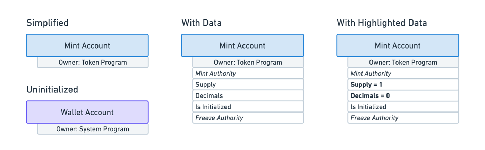
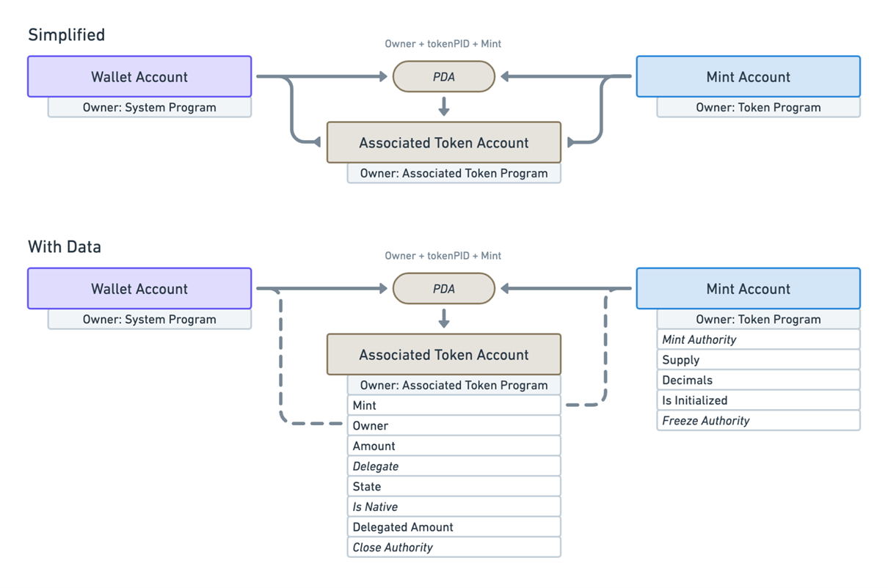

# 1 💵 The Token Program

不起眼的Token——区块链的最初承诺，可能也是您安装钱包的主要原因。从合成股票到数百种狗币，Token是区块链上资产最纯粹的代表。


本课程主要介绍代币在 Solana 上的工作原理。如果您熟悉其他链，那么这里可能存在一些差异，因此请尽量不要与您目前对代币的看法建立太多联系。

讨论Token在 Solana 中的工作方式也是了解不同程序如何使用帐户的绝佳机会。您对 Solana 的了解越深入，您就会发现帐户越重要。**它们像文件系统中的文件一样抽象且灵活，但这也意味着任何给定程序上的帐户可能会变得复杂！** 一开始可能会令人困惑，但给点时间，它就会开始变得更有意义。

Solana 上的Tokens是使用 `Solana Token Program` 创建和管理的，该Program是 `Solana Token Program (SPL)` 中为数不多的Program之一。常规Token和 NFT 都是 Solana 程序库Token。今天我们不会讨论NFT ，但别担心，我们很快就会实现这一目标。

## 🗃 账户关系


我们首先要了解一下情况。`Token Program`需要三个基本帐户：


- 钱包账户 - 这是你的钱包！
- Mint账户 - 存储有关代币Mint的元数据
- Token帐户 - 这与钱包绑定并存储有关该特定钱包的信息，例如它有多少Token。

让我们深入研究每个帐户，看看它的内部是什么样的。

## 🌌 Mint账户





Mint账户存储有关代币本身的元数据，因此不是您对Token的所有权，而是更广泛的Token。它具有以下属性：

- Mint机构 - 只有一个账户可以从Mint账户签名和Mint Token。当您创建Mint账户时，您必须指定Mint机构，可以是您的个人钱包或其他程序
- 供应 - 存在多少Token。 Supply 基本上是在说：“编码大师怎么了？这是总共发行了多少代币。”
- 小数 - 小数是我们允许将令牌分解为多少位小数 - 我们的令牌的精度。这可能会变得棘手，因为链上实际上没有小数。什么？总供应量以整数表示，因此您必须进行数学计算以在小数之间进行转换。例如，如果您将小数设置为 2，并且您的供应量为 100，那么您实际上拥有 1 个代币。供应一种Token，但您允许将其分割成该Token的更小面额。
- 已初始化 - 基本上该帐户是否已准备就绪。它与一般账户有关，而不是Token Program。
- 冻结权限 - 冻结权限类似于Mint权限，您指的是一个人或程序有权冻结（或Mint）。

这是相当标准的做法，为你的钱包设置Mint权限，Mint你想要的一切，然后删除Mint权限，基本上表示将来不会再发行更多的供应。或者，如果您有某种动态发行的Token，通常会将它们作为管理代币铸造的程序来授权。

冻结权限的工作方式相同。

## 👛 Token账户

您可能已经看到生态系统中漂浮着大量不同的Token。你的钱包现在可能装满了很多不同的东西。那么，网络如何知道你持有某些Token呢？帐户存储该数据！执行此操作的首选方法是通过关联的Token帐户。




数据关系和帐户属性如下所示。


Token帐户必须与用户或钱包关联。一个简单的方法是创建一个 [PDA 程序衍生账户](https://docs.solana.com/terminology#program-derived-account-pda)，其地址链接Mint账户和钱包。Token账户PDA的种子是Mint账户的地址和钱包地址（Token程序ID默认存在）。

其中包含很多不同的信息，但现在重    要的是要知道您的钱包实际上并不包含特定的Token。它与您存储Token数量的另一个帐户相关联。另外，还有一个Mint factory帐户，用于存储有关所有Token和更广泛的Mint factory 的信息。


花一些时间盯着图表并用谷歌搜索那些没有意义的部分（比如 wtf 是相关的令牌程序吗？）。毕竟，这很容易！


## 🤑 Token Mint 过程

图表已经看够了，让我们看一些代码来了解这一切是如何发生的。

要创建新的 SPL Token，您首先必须创建Mint factory（保存有关该特定Token的数据的帐户）。


把它想象成烤披萨。您需要一个配方（有关Token的数据）、成分（Mint账户和钱包地址），并需要有人将它们组合在一起（派生一个新的 PDA）。就像披萨一样，如果您拥有所有正确的原料并遵循食谱，您最终将获得美味的新Token！


由于Token程序是 SPL 的一部分，因此您可以使用 `@solana/spl-token Typescript SDK` 非常轻松地创建交易。

`createMint` 调用如下所示：

```ts
const tokenMint = await createMint(
  connection,
  payer,
  mintAuthority,
  freezeAuthority,
  decimals,
)
```

你需要这些参数：
- `connection` - 与集群的 JSON-RPC 连接
- `payer` - 交易付款人的公钥
- `mintAuthority` - 被授权Mint新Token的账户
- `freezeAuthority` - 有权冻结Token账户中Token的账户。如果您不想冻结，请将其设置为空！
- `decimals` - 指定Token所需的小数精度

完成此操作后，您将能够执行后续步骤：
- 创建关联的Token帐户
- 将Token Mint 到帐户
- 如果您愿意，可以通过转账功能空投到多个账户

实现这一目标所需的一切都在 `@solana/spl-token SDK` 中。如果您对特定部分感到好奇，请[查看此处](https://spl.solana.com/token)的文档。

大多数时候，您不需要自己创建原始交易，SDK 就足够了。

关于这一点的一个很酷的旁注——如果出于某种原因你想与另一条指令一起创建Mint factory，你会想要自己创建指令并将它们打包到一个事务中以确保这一切都以原子方式发生。也许您正在构建一个超级秘密的Token Program，您希望所有Tokne在Mint后立即被锁定，而任何人都无法转让他们的Token。

不用说，围绕这些Token正在发生大量的事情。您可以在此处查看每个功能的具体情况，甚至可以查看有关燃烧Token等内容的一些说明:)。
