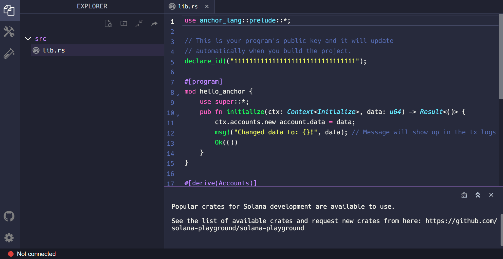
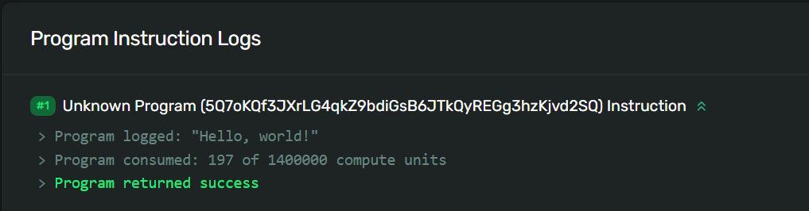

# Hello World

## 长话短说

- Solana 上的`Program`是一种特殊类型的帐户，用于存储和执行指令逻辑。
- Solana 程序有一个处理指令的`entry point`。
- 一个`Program`使用指令中包含的`program_id`、`accounts`列表和`instruction_data`来处理指令。

---

## 概述

Solana运行任意可执行代码的能力是其如此强大的部分原因。Solana Program 与其他区块链环境中的“智能合约”类似，实际上是Solana生态系统的支柱。
随着开发人员和创建者构思和部署新程序，程序的集合每天都在增长。

本课程将向您介绍如何使用 Rust 编程语言编写和部署 Solana 程序。为了避免因设置本地开发环境而分散注意力，我们将使用名为 Solana Playground 的基于浏览器的 IDE。

---

### Rust 基础知识


在我们潜入大楼之前，我们会说“Hello, World!”程序，让我们首先回顾一些 Rust基础知识。如果您想深入了解 Rust，请查看 [Rust 语言书籍](https://doc.rust-lang.org/book/ch00-00-introduction.html)。

---

#### 模块系统

Rust 使用统称为“Module系统”的方式来组织代码。

这包括：
- `modules` - 模块将代码分割成逻辑单元，为组织、作用域和路径的隔离命名空间提供了保护
- `Crate`（板条箱）- 一个crate（板条箱）可以是一个库（library）或一个可执行程序（executable program）。一个crate（板条箱）的源代码通常被细分为多个模块（modules）。
- `packages` - 一个包含一组`crates`以及一个用于指定元数据和包之间依赖关系的清单文件的包

在本课程中，我们将专注于使用 crate 和模块。

---

#### 路径和范围

在Rust中，crate包含了定义功能的模块，可以与多个项目共享。如果我们想要访问模块中的一个项，那么我们需要知道它的“路径”（就像在浏览文件系统时一样）。

将`crate`结构视为一棵树，其中`crate`是树的基础，模块是树枝，每个模块可以有子模块或额外的分支。

特定模块或项目的路径是从创建到该模块的每个步骤的名称，每个步骤之间用`::`分隔。例如，让我们看一下以下结构：

1. 基础`crate`是 `solana_program`
2. `solana_program` 包含一个名为 `account_info` 的模块
3. `account_info` 模块包含一个名为 `AccountInfo` 的项目

`AccountInfo` 的路径为 `solana_program::account_info::AccountInfo`。

如果没有任何其他关键字，我们需要引用整个路径才能在代码中使用 `AccountInfo`。

但是，通过使用 [`use`](https://doc.rust-lang.org/stable/book/ch07-04-bringing-paths-into-scope-with-the-use-keyword.html) 关键字，我们可以将一个`item`纳入范围，以便可以在整个文件中重复使用它，而无需每次都指定完整路径。在 Rust 文件的顶部经常会看到一系列 `use` 命令。

```rust
use solana_program::account_info::AccountInfo
```

---


#### 在 Rust 中声明函数

我们在 Rust 中定义函数时使用 fn 关键字，后跟函数名和一组括号。

```rust
fn process_instruction()
```

我们可以通过在括号内包含变量名并指定其对应的数据类型来向我们的函数添加参数。

Rust被称为一种“静态类型”语言，Rust中的每个值都属于某种“数据类型”。这意味着Rust在编译时必须知道所有变量的类型。在可能存在多种类型的情况下，我们必须为变量添加类型注解。

在下面的示例中，我们创建了一个名为`process_instruction`的函数，它需要以下参数：

- `program_id` - 必须为 `&Pubkey` 类型
- `accounts` - 需要输入 `&[AccountInfo]`
- `instructions_data` - 必须为 `&[u8]` 类型

请注意`process_instruction`函数中每个参数类型前面的`&`符号。在Rust中，`&`表示对另一个变量的“引用”。这样可以在不获取其所有权的情况下引用某个值。这个“引用”保证指向特定类型的有效值。在Rust中创建引用的行为被称为“借用”。

---

在这个例子中，当调用`process_instruction`函数时，用户必须传入必需的参数值。`process_instruction`函数然后引用用户传入的值，并确保每个值都是`process_instruction`函数中指定的正确数据类型。

此外，请注意在`&[AccountInfo]`和`&[u8]`周围的方括号[]。这意味着`accounts`和`instruction_data`参数分别期望类型为`AccountInfo`和`u8`的“切片”。“切片”类似于数组（相同类型的对象的集合），但长度在编译时是未知的。换句话说，accounts和instruction_data参数期望长度未知的输入。


```rust
fn process_instruction(
    program_id: &Pubkey,
    accounts: &[AccountInfo],
    instruction_data: &[u8],
)
```


我们可以通过在函数后使用箭头 `->` 声明返回类型来使函数返回值。

在下面的示例中，`process_instruction`函数现在将返回一个`ProgramResult`类型的值。我们将在下一节中详细介绍这个。

```rust
fn process_instruction(
    program_id: &Pubkey,
    accounts: &[AccountInfo],
    instruction_data: &[u8],
) -> ProgramResult
```

---

#### Result enum

Result是一个标准库类型，表示两种离散的结果：成功（`Ok`）或失败（`Err`）。我们将在未来的课程中更详细地讨论枚举，但你将在本课程后面看到`Ok`的使用，所以了解基础知识很重要。

当你使用`Ok`或`Err`时，必须包含一个值，其类型由代码的上下文决定。例如，一个需要返回类型为`Result`的返回值的函数表示该函数可以返回一个带有嵌入字符串值的`Ok`，或者带有嵌入整数值的`Err`。在这个例子中，整数是一个错误代码，可以用来适当地处理错误。

要返回带有字符串值的成功案例，您可以执行以下操作：

```rust
Ok(String::from("Success!"));
```

要返回整数错误，您可以执行以下操作：

```rust
Err(404);
```

---

### Solana Programs

回想一下，Solana网络上存储的所有数据都包含在所谓的账户中。每个账户都有自己独特的地址，用于标识和访问账户数据。Solana程序只是一种特定类型的Solana账户，用于存储和执行指令。

---

#### Solana Program Crate

使用Rust编写Solana程序时，我们使用`solana_program`库创建。`solana_program`库充当Solana程序的标准库。这个标准库包含了我们用来开发Solana程序的模块和宏。如果你想深入了解`solana_program`库，请[点击](https://docs.rs/solana-program/latest/solana_program/index.html)这里。

对于一个基本的程序，我们需要从solana_program crate中引入以下`item`到作用域中：

```rust
use solana_program::{
    account_info::AccountInfo,
    entrypoint,
    entrypoint::ProgramResult,
    pubkey::Pubkey,
    msg
};
```

- `AccountInfo` - `account_info`模块中的一个结构体，允许我们访问账户信息
- `entrypoint` - 一个宏，声明程序的入口点
- `ProgramResult` - 入口模块中的一种类型，返回 `Result` 或 `ProgramError` 之一
- `Pubkey` -  `pubkey`模块中的一个结构，允许我们将地址作为公钥进行访问
- `msg` - 一个宏，允许我们将消息打印到程序日志中

---

#### Solana 程序入口点

Solana程序需要一个单一的入口点来处理程序指令。使用`entrypoint!`宏来声明入口点。

Solana程序的入口点需要一个带有以下参数的`process_instruction`函数：

- `program_id` - 程序存储的账户地址
- `accounts` - 处理指令所需的账户列表
- `instructions_data` - 序列化的、特定于指令的数据

```rust
entrypoint!(process_instruction);

fn process_instruction(
    program_id: &Pubkey,
    accounts: &[AccountInfo],
    instruction_data: &[u8],
) -> ProgramResult;
```
回想一下，Solana程序账户只存储处理指令的逻辑。这意味着程序账户是“只读”和“无状态”的。程序处理指令所需的“状态”（即一组数据）存储在数据账户中（与程序账户分开）。

为了处理一条指令，指令所需的数据账户必须通过账户参数明确传递到程序中。任何额外的输入必须通过指令数据参数传入。

程序执行后，程序必须返回一个类型为`ProgramResult`的值。这个类型是一个`Result`，其中成功情况下的嵌入值是`()`，失败情况下的嵌入值是`ProgramError`。`()`实际上是一个空值，而`ProgramError`是在`solana_program crate`中定义的错误类型。

...就是这样，你现在已经了解了使用Rust创建Solana程序的基础知识。让我们来实践一下我们已经学到的东西吧！


---

## 演示

我们将使用Solana Playground构建一个“Hello, World！”程序。Solana Playground是一个工具，允许您从浏览器中编写和部署Solana程序。

---

### 1. 设置

点击[这里](https://beta.solpg.io/)打开Solana Playground。接下来，继续删除默认的`lib.rs`文件中的所有内容，并创建一个Playground钱包。



---


### 2. Solana Program Crate

首先，让我们从`solana_program crate`中引入我们所需的所有内容。

```rust
use solana_program::{
    account_info::AccountInfo,
    entrypoint,
    entrypoint::ProgramResult,
    pubkey::Pubkey,
    msg
};

```

接下来，让我们使用`entrypoint!`宏来设置程序的入口点，并创建`process_instruction`函数。当程序被调用时，`msg!`宏允许我们将“`Hello, world!`”打印到程序日志中。

---

### 3. Entry Point

```rust
entrypoint!(process_instruction);

pub fn process_instruction(
    program_id: &Pubkey,
    accounts: &[AccountInfo],
    instruction_data: &[u8]
) -> ProgramResult{
    msg!("Hello, world!");

    Ok(())
}
```

整体来说，“Hello, world!” 程序将如下所示:


```rust
use solana_program::{
    account_info::AccountInfo,
    entrypoint,
    entrypoint::ProgramResult,
    pubkey::Pubkey,
    msg
};

entrypoint!(process_instruction);

pub fn process_instruction(
    program_id: &Pubkey,
    accounts: &[AccountInfo],
    instruction_data: &[u8]
) -> ProgramResult{
    msg!("Hello, world!");

    Ok(())
}
```

---

### 4. 构建和部署

现在让我们使用Solana Playground来构建和部署我们的程序。


---

### 5. 调用程序

最后，让我们从客户端调用我们的程序。在[这里](https://github.com/Unboxed-Software/solana-hello-world-client)下载代码。

本课程的重点是构建我们的Solana程序，因此我们已经提供了客户端代码来调用我们的“Hello, world!”程序。提供的代码包括一个`sayHello`辅助函数，用于构建和提交我们的交易。然后我们在主函数中调用sayHello，并打印一个Solana Explorer的URL，以在浏览器中查看我们的交易详情。

打开`index.ts`文件，你应该会看到一个名为`programId`的变量。继续更新它，使用你刚刚在Solana Playground部署的“Hello, world!"程序的程序ID。

```ts
let programId = new web3.PublicKey("<YOUR_PROGRAM_ID>");
```


您可以在Solana Playground上找到程序ID，参考下面的图片。


接下来，使用 `npm i` 安装 Node 模块。

现在，继续运行 `npm start`。该命令将：

1. 如果不存在，生成一个新的密钥对并创建一个.env文件
2. 空投开发网 SOL
3. 调用“Hello, world!”程序
4. 在Solana Explorer上输出交易URL以查看

将在控制台中打印的交易URL复制到您的浏览器中。向下滚动以查看“程序指令日志”下的“Hello, world！”。



恭喜！您刚刚成功构建并部署了一个 Solana 程序！

---

## 挑战

现在轮到你独立构建一些东西了。由于我们从非常简单的程序开始，你的程序看起来几乎和我们刚刚创建的一样。尽量达到能够独立编写代码而不参考之前的代码的程度，所以请尽量不要在这里复制粘贴。

1. 编写一个新程序，使用`msg!`宏将自己的消息打印到程序日志中。
2. 按照我们在演示中所做的方式构建和部署您的程序。
3. 调用您新部署的程序，并使用Solana Explorer检查您的消息是否已打印在程序日志中。

像往常一样，对这些挑战充满创意，超越基本指示，如果你愿意的话，尽情享受吧！
